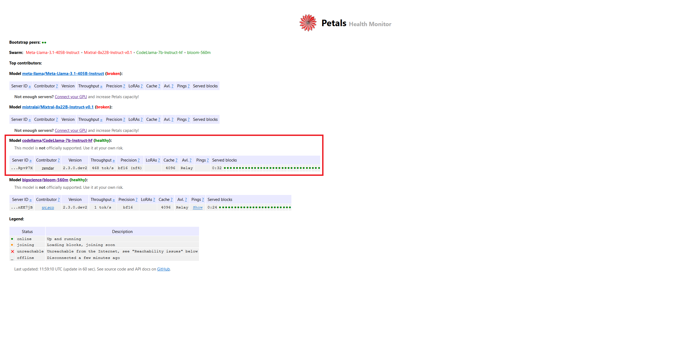
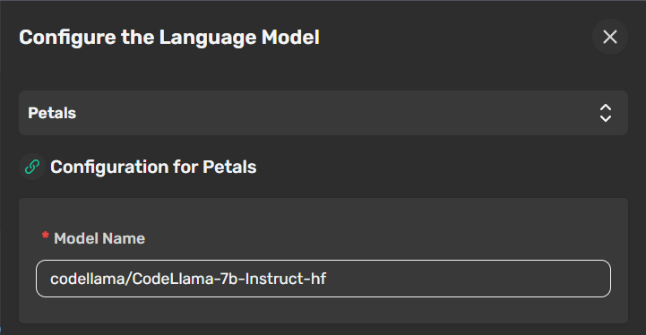

# local-cat 😸🏠

**local-cat** provides a completely local setup for CheshireCat. Local-cat leverages Local runners + Qdrant to run your preferred LLM, Embedder and VectorDB locally.

> [!WARNING]
>
> - **Technical Expertise Required:** Setting up and running local-cat requires some technical know-how.
> - **Hardware Requirements:** Performance may be slow without a recent GPU or NPU.

## What is Petals?

Run large language models at home, BitTorrent‑style, see [homepage](https://petals.dev/) and find more on [github](https://github.com/bigscience-workshop/petals) page.

## Prerequisites

1. Huggingface account, sign up [here](https://huggingface.co/join)

## What you need to do

1. check Petals' [health status](https://health.petals.dev/) page and choose your preferred model
2. Request access to huggingface weights for the model that you want to use, find more [here](https://huggingface.co/docs/hub/models-gated#gated-models)
3. Generate your huggingface [token](https://huggingface.co/settings/tokens)
(usually they grants access in few minutes). When selecting token permission check `Read access to contents of all public gated repos you can access` option under `Repositories` group.
4. Once your token is created, create an `.env` file by duplicating `.env.example` and fill `HUGGINGFACE_TOKEN` it with your token.

### Setup Instructions

Ollama container is removed because we will use Petals as replacement.
Currently, you have to build the cheshire-cat container locally. 
The Petals container is used to share some of the gpu resources with the other users and also to run the chosen model.

To run local-cat with Petals, follow these steps:

> [!IMPORTANT]
> Don't enable DEBUG mode in .env file otherwise this will interfere with Petals

1. fill .env file with the desired settings
2. run `docker compose -f compose.petals.yml up -d`

### Petals container setup
1. The Petals container should start. Inside log you will see that is loading model blocks. 

```
...
2024-10-27 12:31:59 petals                      | Login successful
2024-10-27 12:32:00 petals                      | /home/petals/src/petals/server/block_functions.py:165: SyntaxWarning: assertion is always true, perhaps remove parentheses?
2024-10-27 12:32:00 petals                      |   assert (
2024-10-27 12:32:00 petals                      | Oct 27 11:32:00.715 [INFO] Running Petals 2.3.0.dev2
2024-10-27 12:32:01 petals                      | Oct 27 11:32:01.116 [INFO] Make sure you follow the Llama terms of use: https://llama.meta.com/llama3/license, https://llama.meta.com/llama2/license
2024-10-27 12:32:01 petals                      | Oct 27 11:32:01.116 [INFO] Using DHT prefix: CodeLlama-7b-Instruct-hf
2024-10-27 12:32:12 petals                      | Oct 27 11:32:12.757 [INFO] This server is accessible via relays
2024-10-27 12:32:14 petals                      | Oct 27 11:32:14.059 [INFO] Connecting to the public swarm
2024-10-27 12:32:14 petals                      | Oct 27 11:32:14.059 [INFO] Running a server on ['/ip4/127.0.0.1/tcp/31330/p2p/12D3KooWEbeDea5LSiaJEBuWLYh85h8kPgTXM8UNYo7bUCRpvP7X', '/ip4/172.18.0.2/tcp/31330/p2p/12D3KooWEbeDea5LSiaJEBuWLYh85h8kPgTXM8UNYo7bUCRpvP7X', '/ip6/::1/tcp/31330/p2p/12D3KooWEbeDea5LSiaJEBuWLYh85h8kPgTXM8UNYo7bUCRpvP7X']
2024-10-27 12:32:14 petals                      | Oct 27 11:32:14.219 [INFO] Model weights are loaded in bfloat16, quantized to nf4 format
2024-10-27 12:32:14 petals                      | Oct 27 11:32:14.219 [INFO] Attention cache for all blocks will consume up to 2.00 GiB
2024-10-27 12:32:14 petals                      | Oct 27 11:32:14.220 [INFO] Loading throughput info
2024-10-27 12:32:14 petals                      | Oct 27 11:32:14.239 [INFO] Reporting throughput: 467.9 tokens/sec for 32 blocks
2024-10-27 12:32:18 petals                      | Oct 27 11:32:18.175 [INFO] Announced that blocks [0, 1, 2, 3, 4, 5, 6, 7, 8, 9, 10, 11, 12, 13, 14, 15, 16, 17, 18, 19, 20, 21, 22, 23, 24, 25, 26, 27, 28, 29, 30, 31] are joining
2024-10-27 12:34:02 petals                      | Oct 27 11:34:02.638 [INFO] Loaded codellama/CodeLlama-7b-Instruct-hf block 0
2024-10-27 12:34:08 petals                      | Oct 27 11:34:08.157 [INFO] Loaded codellama/CodeLlama-7b-Instruct-hf block 1
2024-10-27 12:34:13 petals                      | Oct 27 11:34:13.249 [INFO] Loaded codellama/CodeLlama-7b-Instruct-hf block 2
2024-10-27 12:34:17 petals                      | Oct 27 11:34:17.088 [INFO] Loaded codellama/CodeLlama-7b-Instruct-hf block 3
2024-10-27 12:34:21 petals                      | Oct 27 11:34:21.051 [INFO] Loaded codellama/CodeLlama-7b-Instruct-hf block 4
2024-10-27 12:34:24 petals                      | Oct 27 11:34:24.946 [INFO] Loaded codellama/CodeLlama-7b-Instruct-hf block 5
2024-10-27 12:34:28 petals                      | Oct 27 11:34:28.609 [INFO] Loaded codellama/CodeLlama-7b-Instruct-hf block 6
2024-10-27 12:34:32 petals                      | Oct 27 11:34:32.714 [INFO] Loaded codellama/CodeLlama-7b-Instruct-hf block 7
2024-10-27 12:34:36 petals                      | Oct 27 11:34:36.334 [INFO] Loaded codellama/CodeLlama-7b-Instruct-hf block 8
2024-10-27 12:34:40 petals                      | Oct 27 11:34:40.247 [INFO] Loaded codellama/CodeLlama-7b-Instruct-hf block 9
2024-10-27 12:34:43 petals                      | Oct 27 11:34:43.998 [INFO] Loaded codellama/CodeLlama-7b-Instruct-hf block 10
2024-10-27 12:34:49 petals                      | Oct 27 11:34:49.203 [INFO] Loaded codellama/CodeLlama-7b-Instruct-hf block 11
2024-10-27 12:34:54 petals                      | Oct 27 11:34:54.436 [INFO] Loaded codellama/CodeLlama-7b-Instruct-hf block 12
2024-10-27 12:34:59 petals                      | Oct 27 11:34:59.354 [INFO] Loaded codellama/CodeLlama-7b-Instruct-hf block 13
2024-10-27 12:35:04 petals                      | Oct 27 11:35:04.460 [INFO] Loaded codellama/CodeLlama-7b-Instruct-hf block 14
2024-10-27 12:35:09 petals                      | Oct 27 11:35:09.608 [INFO] Loaded codellama/CodeLlama-7b-Instruct-hf block 15
2024-10-27 12:35:14 petals                      | Oct 27 11:35:14.763 [INFO] Loaded codellama/CodeLlama-7b-Instruct-hf block 16
2024-10-27 12:35:19 petals                      | Oct 27 11:35:19.843 [INFO] Loaded codellama/CodeLlama-7b-Instruct-hf block 17
2024-10-27 12:35:24 petals                      | Oct 27 11:35:24.982 [INFO] Loaded codellama/CodeLlama-7b-Instruct-hf block 18
2024-10-27 12:35:29 petals                      | Oct 27 11:35:29.732 [INFO] Loaded codellama/CodeLlama-7b-Instruct-hf block 19
2024-10-27 12:35:34 petals                      | Oct 27 11:35:34.720 [INFO] Loaded codellama/CodeLlama-7b-Instruct-hf block 20
2024-10-27 12:35:39 petals                      | Oct 27 11:35:39.750 [INFO] Loaded codellama/CodeLlama-7b-Instruct-hf block 21
2024-10-27 12:35:44 petals                      | Oct 27 11:35:44.851 [INFO] Loaded codellama/CodeLlama-7b-Instruct-hf block 22
2024-10-27 12:35:49 petals                      | Oct 27 11:35:49.791 [INFO] Loaded codellama/CodeLlama-7b-Instruct-hf block 23
2024-10-27 12:36:46 petals                      | Oct 27 11:36:46.508 [INFO] Loaded codellama/CodeLlama-7b-Instruct-hf block 24
2024-10-27 12:36:50 petals                      | Oct 27 11:36:50.304 [INFO] Loaded codellama/CodeLlama-7b-Instruct-hf block 25
2024-10-27 12:36:54 petals                      | Oct 27 11:36:54.170 [INFO] Loaded codellama/CodeLlama-7b-Instruct-hf block 26
2024-10-27 12:36:57 petals                      | Oct 27 11:36:57.812 [INFO] Loaded codellama/CodeLlama-7b-Instruct-hf block 27
2024-10-27 12:37:01 petals                      | Oct 27 11:37:01.571 [INFO] Loaded codellama/CodeLlama-7b-Instruct-hf block 28
2024-10-27 12:37:05 petals                      | Oct 27 11:37:05.411 [INFO] Loaded codellama/CodeLlama-7b-Instruct-hf block 29
2024-10-27 12:37:09 petals                      | Oct 27 11:37:09.223 [INFO] Loaded codellama/CodeLlama-7b-Instruct-hf block 30
2024-10-27 12:37:13 petals                      | Oct 27 11:37:13.155 [INFO] Loaded codellama/CodeLlama-7b-Instruct-hf block 31
2024-10-27 12:37:17 petals                      | Oct 27 11:37:17.658 [INFO] Server is reachable from the Internet. It will appear at https://health.petals.dev soon
2024-10-27 12:37:17 petals                      | Oct 27 11:37:17.862 [INFO] Started
```

2. Once finished, check Petals [health status](https://health.petals.dev/) page to see if your model is ready.




### Cheshire Cat Setup
1. login into cheshire-cat as admin, go inside settings and select `Petals` as model
2. put the model name inside the  model name field and save (use copy button from huggingface models page)



3. The cat will start downloading the model's weights. This operation may take a while, just wait to see the progress bar inside the log reaching 100% before start using the cat.

```
...
2024-10-27 12:53:48 Oct 27 11:53:48.703 [INFO] Make sure you follow the Llama terms of use: https://llama.meta.com/llama3/license, https://llama.meta.com/llama2/license
2024-10-27 12:53:48 Oct 27 11:53:48.703 [INFO] Using DHT prefix: CodeLlama-7b-Instruct-hf
2024-10-27 12:56:54 
Downloading shards:   0%|          | 0/2 [00:00<?, ?it/s]
Downloading shards:  50%|█████     | 1/2 [02:17<02:17, 137.13s/it]
Downloading shards: 100%|██████████| 2/2 [03:05<00:00, 84.74s/it] 
Downloading shards: 100%|██████████| 2/2 [03:05<00:00, 92.60s/it]
2024-10-27 12:56:56 
Loading checkpoint shards:   0%|          | 0/2 [00:00<?, ?it/s]
Loading checkpoint shards:  50%|█████     | 1/2 [00:00<00:00,  2.09it/s]
Loading checkpoint shards: 100%|██████████| 2/2 [00:00<00:00,  3.12it/s]
Loading checkpoint shards: 100%|██████████| 2/2 [00:00<00:00,  2.91it/s]
```

This will happen every time the Cat will be started.

## Ollama Setup

> [!IMPORTANT]
> Ollama can be instable with **latest models** or **non-common use** models(like qwen, deepseek)!!
> If you encount inference problems, downgrade ollama image or [open an issue to Ollama](https://github.com/ollama/ollama/issues)

### Setup Instructions

1. **Clone the Repository:** `git clone https://github.com/cheshire-cat-ai/local-cat.git`
2. **Navigate to the Directory:** `cd local-cat`
3. **Start local-cat:** `docker-compose up -d`
4. **Pull Your Desired Model:** `docker exec ollama_cat ollama pull <model_name:tag>`
   - Replace `<model_name:tag>` with the specific model you want to use.
5. **Your Setup is Complete!**
   - You can now install additional plugins or start interacting with local-cat.

### Use Ollama with MacOS GPU Acceleration

Ollama normally handles running the model with GPU acceleration. In order to use GPU acceleration on Mac OS it is recommended to run Ollama directly on the host machine rather than inside Docker. More info [here](https://ollama.com/blog/ollama-is-now-available-as-an-official-docker-image).
> [!NOTE]
> This is recommended until GPU acceleration is supported by Docker Desktop on MacOS.

To use local-cat with GPU acceleration on Mac:

1. Install the menu bar app version of Ollama, which is the current recommended setup for MacOS users.
2. Start using the following command `docker compose -f docker-compose-macos.yml up`
3. Configure the Ollama Base URL in the cat's LLM settings to `http://host.docker.internal:11434`.

> Note: This configuration allows Docker containers to communicate with your locally running Ollama service and leverage MacOS GPU acceleration.

### Use Ollama with AMD

To use local-cat with [AMD graphics that supports ROCm](https://rocm.docs.amd.com/en/docs-5.7.0/release/gpu_os_support.html#linux-supported-gpus), use the following command:

```bash
docker compose -f docker-compose-amd.yml up
```
